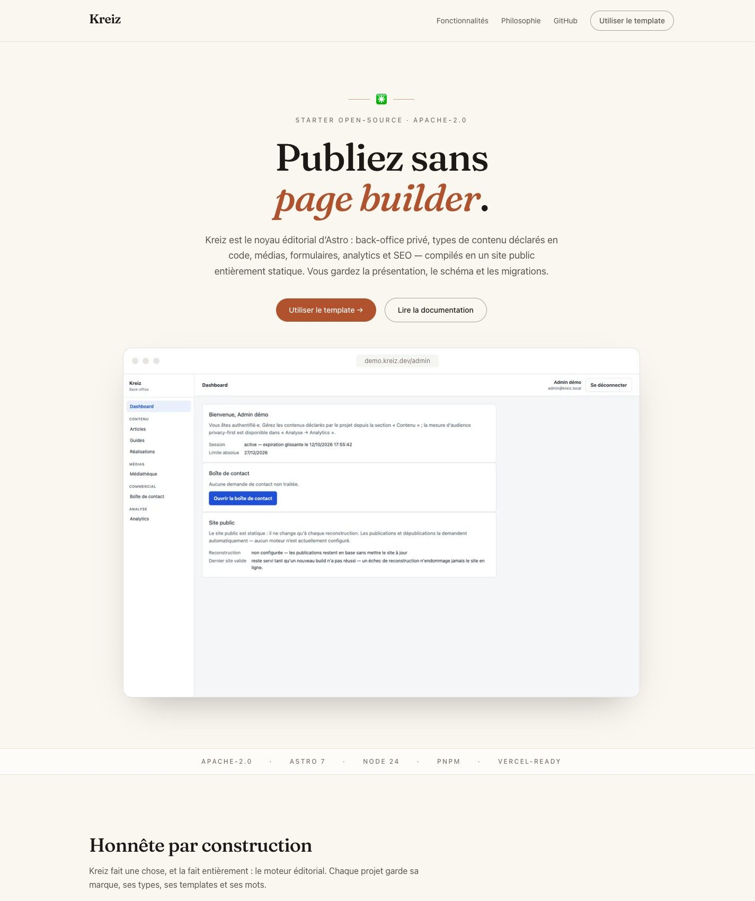

# Kreiz

[](https://github.com/cyril-belin/kreiz/actions/workflows/ci.yml)
[](LICENSE)

> An Astro editorial core to publish without a page builder.

**Official website: https://cyril-belin.github.io/kreiz/**



Kreiz provides the editorial engine: a private admin, code-declared content
types, a draft/publish model with frozen public snapshots, media, rich text,
forms, analytics and SEO — compiled to a static-first public site. Each
project keeps the frontend: templates, branding, content types and wording.

> The back office manages content. The frontend controls presentation.

## What is Kreiz?

**Is**: a batteries-included editorial engine that compiles to a
static-first public site — only the admin and small public endpoints run on
a server. `Save ≠ Publish` is structural: the public build reads only frozen
`published_*` snapshots; publishing requests a rebuild, and a failed rebuild
never damages the served site.

**Is not**: a page builder, a hosted CMS, a multi-role workflow tool, an
e-commerce or newsletter platform. No plugin marketplace, no theme system.

## Start here

- **Website** — <https://cyril-belin.github.io/kreiz/> — the product, in one page
- **Documentation** — <https://cyril-belin.github.io/kreiz/docs/> — start, concepts, customize, deploy (in French)
- **Build with AI** — <https://cyril-belin.github.io/kreiz/docs/ai/> — the master prompt for AI-assisted building
- **Use this template** — <https://github.com/cyril-belin/kreiz/generate> — a project starts as a copy, not an npm install
- **Developer guide** — [`docs/build-a-project.md`](docs/build-a-project.md) — build a real project without reading the core

## Build with AI

Kreiz is code-first: content types, forms, SEO and templates all live in
files, so an AI assistant or agent with access to the project can do real
work in the Project — frontend, pages, content types, forms, customization,
integration. The Core stays stable and untouched.

The public documentation ships a master prompt to copy into your assistant,
what the AI can do, what it must avoid, and example requests:
<https://cyril-belin.github.io/kreiz/docs/ai/>

## Core vs Project

| Owned by the Project | Owned by the Core |
|---|---|
| content types, forms, SEO/analytics config | admin UI, APIs, guards, CSRF, audit |
| templates and public pages | publication snapshots, redirects engine |
| schema composition + migrations | repositories, services, ports/adapters |
| branding, wording, layout | rich text format + renderer, media pipeline |

The package boundary is mechanical: the `exports` map is the only public
surface (deep imports fail typecheck). See [`docs/api.md`](docs/api.md).

## Main capabilities

- **Admin** — email + Argon2id, revocable server-side sessions, login rate
  limiting, session-bound CSRF, append-only audit log, `kreiz` CLI
- **Content & publication** — generated CRUD, draft/publish with frozen
  public snapshots, SSR preview with the project's real templates, automatic
  301 redirects on published slug changes
- **Media** — direct presigned uploads to any S3-compatible storage,
  server-side verification, async responsive variants (WebP + AVIF,
  EXIF stripped), explicit lifecycle with retry/recovery
- **Rich text** — versioned JSON document, Tiptap admin editor behind a
  strict boundary, deterministic public renderer (never stored HTML)
- **Forms** — progressive HTML (works without JavaScript), layered
  anti-spam, idempotency, persistence before notification, retry and
  admin re-send
- **Analytics** — ~2 KB beacon, no cookies, no IP stored, DNT/GPC
  respected, SQL dashboard, configurable retention
- **SEO** — code-declared canonical base, resolved head, typed JSON-LD,
  prerendered `sitemap.xml` and `robots.txt`, editorial `noindex`

## Developer quick start

Requires Node 24 LTS and pnpm.

```sh
pnpm install
pnpm build                       # core (dist/) then demo
cp apps/demo/.env.example apps/demo/.env    # set KREIZ_DATABASE_URL (Neon branch)
                                           # and KREIZ_SECRET (openssl rand -base64 32)
pnpm db:migrate                  # apply apps/demo migrations (app-owned chain)
pnpm --filter @kreiz/core exec kreiz admin:create   # first admin (interactive)
pnpm --filter @kreiz/demo dev    # http://127.0.0.1:4321 — admin at /admin
```

The showcase website runs without any database or secret:
`pnpm --filter @kreiz/website dev` (http://localhost:4322).

Verification commands: `pnpm typecheck`, `pnpm lint`, `pnpm test`
(unit + integration on real PostgreSQL), `pnpm test:e2e` (Playwright,
per-slice critical paths plus the global end-to-end journey).

Every `KREIZ_*` variable, with defaults and dev-vs-prod differences:
[`docs/configuration.md`](docs/configuration.md).

## Architecture & advanced documentation

- pnpm monorepo: [`packages/core`](packages/core) (`@kreiz/core`, the engine),
  [`apps/demo`](apps/demo) (reference consumer — public API only, no hacks) and
  [`apps/website`](apps/website) (the official showcase — static, deployed on
  GitHub Pages; it does not use the Core at runtime)
- `kreiz()`, the Astro integration, injects the whole back-office
  (`/admin/*`, SSR, session-guarded, CSRF) and the only public endpoints
  (forms, analytics, maintenance cron, prerendered beacon/sitemap/robots)
- Layered core: domain → services → ports (`ObjectStorage`, `ImageTransformer`,
  `Mailer`, `RebuildTrigger`) → reference adapters (S3-compatible, Sharp,
  webhook mailer, deploy hook) → Drizzle/Neon data layer —
  see [`docs/architecture.md`](docs/architecture.md)
- Static-first on Vercel: the public site is prerendered, one serverless
  function serves `/admin/*`, publishing triggers a deploy-hook rebuild
  ([`docs/operations.md`](docs/operations.md))

### Public documentation

For starting, understanding Kreiz, building with an AI, customizing and
deploying — in French, versioned with the code:
<https://cyril-belin.github.io/kreiz/docs/>

### Developer reference

- [`docs/architecture.md`](docs/architecture.md) — layers, integration, the Save/Publish/Snapshot/Build model
- [`docs/api.md`](docs/api.md) — public API surface, subpath by subpath
- [`docs/configuration.md`](docs/configuration.md) — project config and environment variables reference
- [`docs/build-a-project.md`](docs/build-a-project.md) — build a real project from the template
- [`docs/operations.md`](docs/operations.md) — runbooks, recovery table, cron expectations
- [`docs/production-readiness.md`](docs/production-readiness.md) — ready / conditional / not yet
- [`docs/security-review-final.md`](docs/security-review-final.md) — adversarial review: findings, fixes, remaining conditions
- [`docs/technical-debt.md`](docs/technical-debt.md) — honest debt register · [`docs/privacy-data-map.md`](docs/privacy-data-map.md) — per-table data map
- [`docs/handoff.md`](docs/handoff.md) — developer handoff and performance baseline · [`docs/website.md`](docs/website.md) — the showcase site
- [`docs/cadrage.md`](docs/cadrage.md) — original vision and decision record · [`docs/slices/`](docs/slices) — per-slice verification logs

## Production status

**Pre-release — conditionally ready.** Core V1 is closed and verified:
756 unit and integration tests (integration on real PostgreSQL), 84 E2E
tests including a global end-to-end journey. A final adversarial security
review and an independent senior review found no critical or high
vulnerability left open; the fixes are merged into `main`.

Before running a real production site, review the remaining conditions:

- define the contact-requests retention policy (opt-in via
  `KREIZ_CONTACT_RETENTION_DAYS`)
- declare the external cron that calls the maintenance endpoint
  (`POST /api/maintenance`)
- deploy on Vercel (the IP-header trust model is Vercel-specific)
- derive the Project CSP from its storage configuration

Details: [`docs/production-readiness.md`](docs/production-readiness.md) and
[`docs/security-review-final.md`](docs/security-review-final.md).

Baseline: Node 24 LTS · Astro 7 · Tailwind 4 · Neon PostgreSQL + Drizzle ·
Vercel. Exact versions are locked in `pnpm-lock.yaml`.

## License

Licensed under the Apache License 2.0. See [LICENSE](LICENSE).

The repository is public, open source and configured as a GitHub Template:
use [**Use this template**](https://github.com/cyril-belin/kreiz/generate)
to start your own site.
